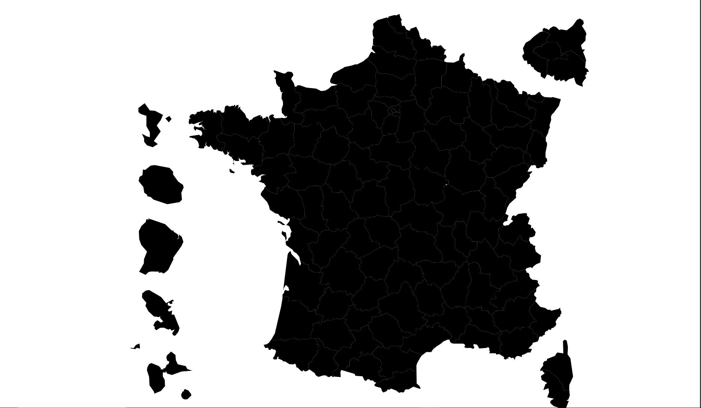
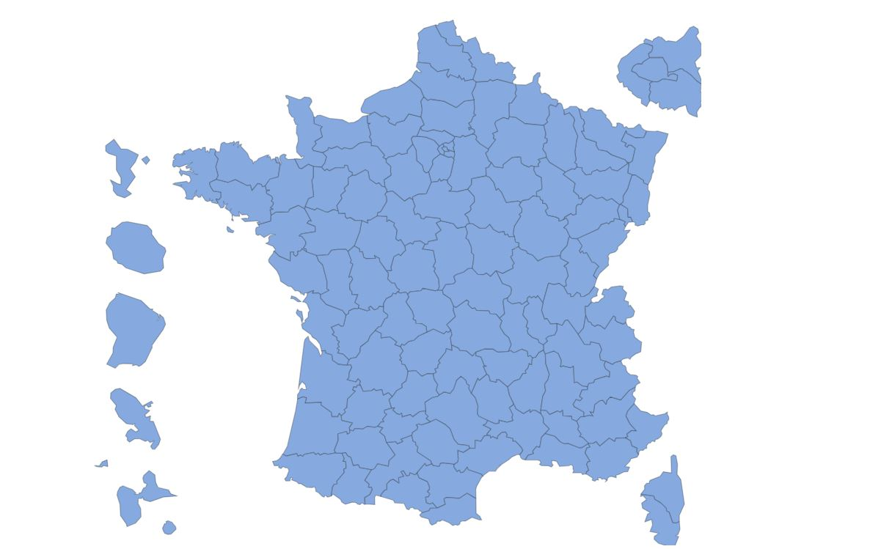
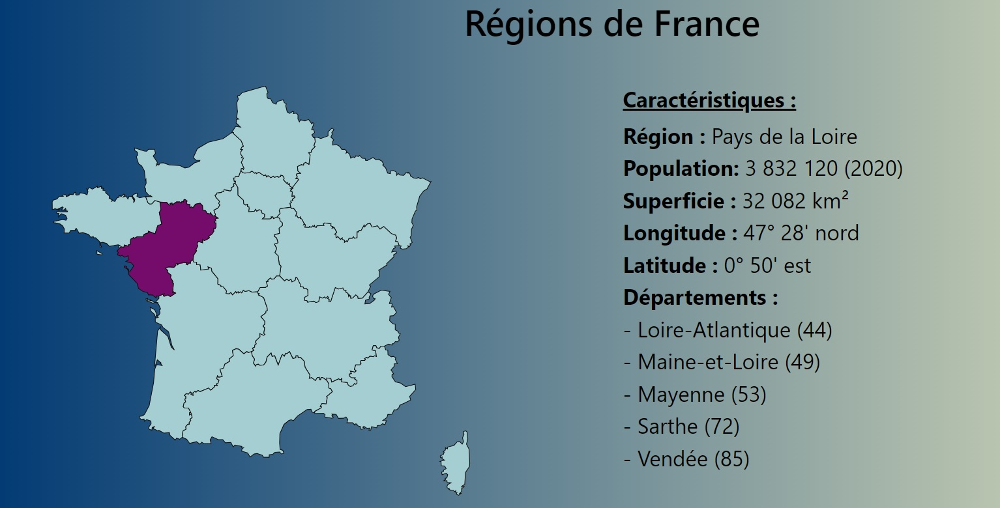

# Carte interactive des régions de France
Vous devez faire une carte interactive, pour faire apparaitre les régions de France

Les consignes :
1. Chaque région à une couleur au survol
2. Quand on clique sur une région, les informations de celle-ci apparaissent
3. Voici les informations demandées pour les régions:
     - Le nom de la région
     - Le nombre de population
     - La superficie
     - La longitude et la latitude
     - et les départements qui composent la région
4. L'image format svg est fournie

Autoriser : 
  

Vous devez dans premier temps commencer par changer la couleur de la carte
&nbsp;&nbsp;

Après modification de l'image :
&nbsp;&nbsp;

Résultat attendu :
&nbsp;&nbsp;
